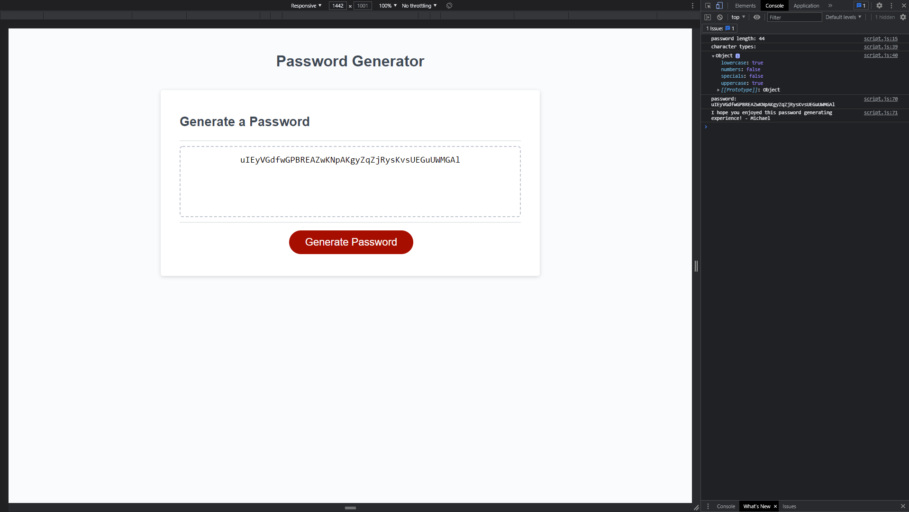

# Password Generator

For this challenge, I was tasked with creating an simple random password generator. The page and its associated stylings were provided in the starter code which can be found <a href="https://github.com/coding-boot-camp/friendly-parakeet">here</a>.

This is an introductory javascript exercise. When the button to generate a password is clicked, the user is then prompted to decide how long they would like their password to be, and which types of characters they would like their password to contain. Questions and text are presented to the user through the window object in the form of alerts, confirms, and prompts. Once the user has answered all of the questions, the randomly generated password is displayed.

The deployed site is viewable by clicking <a href="https://mikeyrod22.github.io/JAVASCRIPT-CHALLENGE-password-generator/">here</a>. Enjoy!

***

## _WARNING!_

This was a small task for my class. _The passwords generated here are not intended for secure use._ Please do not use this for generating important passwords!
